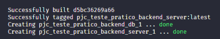
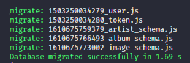
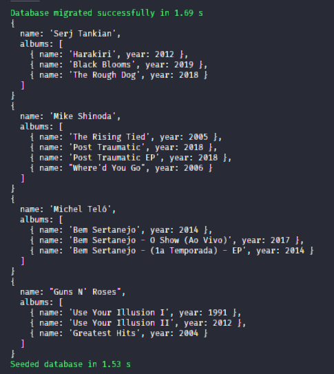
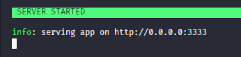
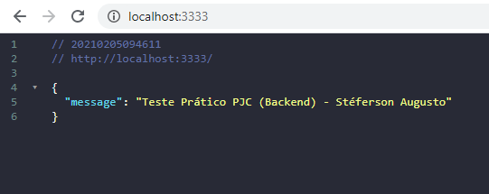
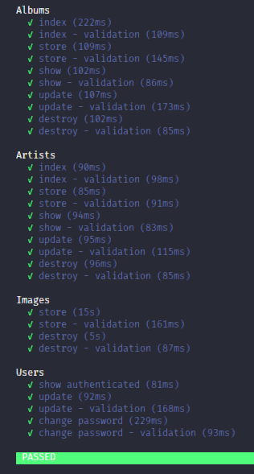

# Teste Prático - Backend

Esse projeto foi construído com Adonis JS, Postgres e Docker.
De maneira que todos os critérios da avaliação foram alcançados.

<h4 align="center">
  <a href="#started" >
    Instalação
  </a>
  |
  <a href="#tests" >
    Testes Automatizados
  </a>
  |
  <a href="#utils" >
    Utilidades
  </a>
  |
  <a href="#license" >
    Licença
  </a>
</h4>

<h2 name="started">🔧 Instalação</h2>

Clone ou baixe o projeto do Github

```bash
git clone https://github.com/steferson-augusto/pjc_teste_pratico_backend.git
```

Abra o diretório do projeto e execute `npm install`.

Ainda na raiz do projeto, execute `docker-compose up`.

Agora espere a montagem dos containers

<p align="center">
  
</p>

Espere a conclusão das migrations

<p align="center">
  
</p>

Aguarde os seeds serem concluídos

<p align="center">
  
</p>

Espere a inicialização do servidor

<p align="center">
  
</p>

Pronto! A aplicação já está pronta para uso através de `http://localhost:3333/`

<p align="center">
  
</p>

Após iniciado, certifique-se de que existe um bucket chamado `miniotest` em `https://play.min.io/minio/`, caso contrário não será possível adicionar imagens de capa a um álbum.

Não há rotas para cadastro de usuário e só existe um usuário cadastrado via seed. O acesso é:

<b>Email:</b> superuser@email.com

<b>Senha:</b> aIJUyry6D7wZleDm

<br/>
<h2 name="tests">🔧 Testes Automatizados</h2>

Para executar testes automatizados basta executar o seguinte comando:

```js
adonis test
```

<p align="center">
  
</p>

<br/>
<h2 name="utils">📏 Utilidades</h2>

<ul>
  <li>
    <a href="https://adonisjs.com/docs/4.1/installation" target="_blank">Adonis JS</a>
    - documentação oficial
  </li>

  <li>
    <a href="https://github.com/steferson-augusto/pjc_teste_pratico_backend/blob/master/Insomnia_backend.json" target="_blank">Insomnia File</a> - arquivo exportado do Insomnia com endpoints configuradas
  </li>

  <li>
    <a href="https://drive.google.com/file/d/1QdF-veSF1TIU-oT4g_cnG5Qe3JxXPVtv/view" target="_blank">Teste Prático</a> - arquivo guia para a criação deste projeto
  </li>
</ul>

<br/>
<h2 name="license">📝 Licença</h2>
<p>Este projeto está sob uma licença MIT. Veja mais informações em <a href="https://github.com/steferson-augusto/puppeteer-image-name/blob/main/LICENSE" target="_blank">LICENSE</a>.</p>

---

<p>Criado por <a href="https://www.linkedin.com/in/st%C3%A9ferson-augusto-4b0b9b124/" target="_blank">Stéferson Augusto</a></p>
